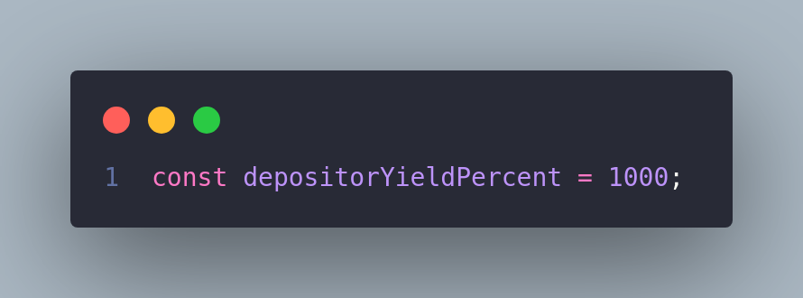

# Contract Layout

## Dome Protocol Smart Contract

**Description:**

[The Dome Protocol Smart Contract](./contracts/DomeProtocol.sol) enables the creation of dome structures with predefined governance settings, beneficiaries, and yield generation mechanisms.

**Features:**

- **Dome Creation:** Users can create dome structures by providing dome information, beneficiary details, governance settings, and yield generation parameters. Domes serve as decentralized entities with predefined rules and functionalities.

- **Governance Integration:** The protocol integrates with governance mechanisms, allowing dome structures to be governed by predefined rules and decision-making processes. Governance settings include parameters such as voting delay, voting period, and proposal threshold.

- **Yield Generation:** Domes generate yield from deposited assets, and users can specify the percentage of generated yield allocated to depositors as rewards.

- **Reward Token Minting:** The protocol supports the minting of reward tokens, which represent users' share of generated yield. Reward tokens can be minted for users based on their contributions to dome structures.

- **Fee Management:** The protocol includes mechanisms for managing system owner percentages and dome creation fees, providing flexibility for protocol governance and sustainability.

**Interfaces:**

- **Ownable:** Implements ownership functionalities, allowing certain operations to be restricted to contract owners.
- **IGovernanceFactory:** Interface for creating governance contracts for dome structures.
- **IWrappedVotingFactory:** Interface for creating wrapped voting contracts for dome governance.
- **IDomeFactory:** Interface for initializing dome structures with specified parameters.
- **IPriceTracker:** Interface for converting asset amounts to USDC equivalents for reward token minting.
- **IRewardToken:** Interface for minting reward tokens for dome participants.

## DomeCore Smart Contract

**Description:**

[The Dome smart contract](./contracts/DomeCore.sol) facilitates the creation of dome structures where users can deposit assets, mint shares, and earn rewards. The contract supports various functionalities including depositing, withdrawing, claiming rewards, and donating assets.

**Features:**

- **Deposit and Mint:** Users can deposit assets into the dome and mint shares, allowing them to participate in the dome's activities.
- **Withdraw and Redeem:** Users can withdraw assets from the dome and redeem their shares to retrieve their deposited assets.
- **Yield Generation:** The dome generates yield from deposited assets, which can be claimed by users as rewards.
- **Beneficiary Distribution:** Generated yield and donated assets are distributed among predefined beneficiaries according to specified percentages.
- **Rewards Distribution:** Rewards are distributed to users based on their share of deposited assets and additional system fees.

**Interfaces:**

- **IERC20:** Implements the ERC20 standard for fungible tokens.
- **IERC4626:** Integrates additional ERC4626 functionality for ERC20 tokens.
- **IBuffer:** Interface for the buffer contract used for asset management and distribution.
- **IDomeProtocol:** Interface for the dome protocol contract.

## DomeGovernor Smart Contract

**Description:**

[The DomeGovernor smart contract](./contracts/Governance.sol) is a decentralized governance protocol. It serves as a governance mechanism for the Dome protocol, allowing token holders to propose and vote on changes to the protocol. The contract integrates with the Dome protocol and supports various governance functionalities including proposal creation, voting, execution and cancellation.

**Features:**

- **Proposal Creation:** Token holders can create proposals to suggest changes or actions within the Dome protocol. Proposals include details such as the recipient wallet, asset amount, title, and description.

- **Voting:** Token holders can vote on proposed actions using their voting power, which is determined by the number of tokens they hold. The contract supports weighted voting based on token holdings.

- **Execution and Cancellation:** Successfully voted proposals can be executed to implement the proposed actions. Proposals can also be canceled if deemed necessary by the token holders.

- **Reserve Fund Management:** The contract includes functionality to transfer reserve funds from the Dome protocol to designated wallets, enabling efficient fund management.

**Interfaces:**

- **IDome:** Interface for the Dome protocol contract, providing access to protocol-related functionalities.

- **IBuffer:** Interface for the buffer contract used for asset management within the Dome protocol.

- **IWrappedVoting:** Interface for the wrapped voting contract, facilitating interaction between the DomeGovernor and voting mechanisms.

# DomeProtocol


# Flow of steps

## Staking

First of all the user should approve Dome to be able to pull required assets.
Let's say the Dome uses USDC as it's underlying asset, in that case USDC should be approved.

If you want to know the address of the asset, that uses Dome to generate yield, you can call the `asset` function inside Dome instance, which will return the underlying asset's address.

In the case of USDC it will be the USDC contract address.
After that we should give allowance to Dome instance, so that it is able to pull the USDC.

On asset contract should be called `approve` function which accepts 2 arguments:

- `Spender` - in this case the spender should be the Dome instance
- `Amount` - the amount of assets you willing to give allowance, it should be more or equal to the amount you will to stake.


## Voting

If a staker wants to participate in proposals votes, the staked assets should be wrapped in exchange for voting tokens with ratio 1:1.

In that case we should call give the `Wrapped Voting contract` the `allowance` to `pull staked tokens` and to wrap them.

On Dome instance contract should be called `approve` function which accepts 2 arguments:

- `Spender` - in this case the wrapped voting contract address should be passed.
- `Amount` - the amount of staked tokens you willing to wrap.

After granting allowance to pull the tokens, the `depositFor` should be called on Wrapped Voting contract side, which will `pull the stake` tokens, then `wrap` them and give `wrapped voting tokens in exchange`.

After receiving the wrapped tokens, the holder should `delegate` its voting power to someone, usually to themselves.


## Unstake

If a staker wants to exit the dome and get back its assets, then all `voting tokens` should be `unwrapped` if there is any.

To check the voting balance, the `balanceOf` function on `Wrapped Voting contract` should be called, which will return the current wrapped tokens balance of the user, the function takes 1 argument:

- `owner` - the address of the holder we want to check.

If the balance is positive the we should proceed and unwrap section, if not skip it.

### Unwrap

The `withdrawTo` function should be called on Wrapped Voting contract side, which will `burn` the wrapped voting tokens, then `send back` the staked tokens with ratio 1:1, the function takes 1 argument:

- `to` - the receiver of staked tokens


### Unstake

After receiving the staked tokens, the holder now is able to unstake them and receive assets in exchange.
The `withdraw` or `redeem` functions should be called in this case, they take 3 arguments.
`withdraw` function takes `assets amount` as 1'th argument staker willing to withdraw, whereas the `redeem` function takes the `shares amount`.

- `assets/shares amount` - the amount of assets(withdraw) or shares(redeem) the holder is willing to withdraw
- `receiver` - receiver of the underlying assets (e.g. USDC)
- `owner` - owner of the staked tokens (usually the holder of staked tokens)


## Prerequisites

Before you begin, ensure you have met the following requirements:

- [Node.js](https://nodejs.org/) and [npm](https://www.npmjs.com/) installed on your machine.

## Installation

1. Clone the repository to your local machine:

```bash
git clone git@github.com:DomeDAO/dome-contracts.git
```

2. Navigate to the project directory:

```bash
cd dome-contracts
```

3. Install the project dependencies using npm:

```bash
npm install
```

## Compiling contracts

To compile the contract run `npm run build` in your terminal.

```bash
npm run build
```

After successful compilation you'll get the output:

```bash
Compiled 52 Solidity files successfully
```

Which indicates, as you may have guessed, that contracts have been successfully compiled and they're ready to be used.

## Environment Variables

To deploy the protocol, you will need to add the following `environment variables` to your .env file:

`DEPLOY_PRIV_KEY`
`DOME_CREATION_FEE`
`SYSTEM_OWNER_PERCENTAGE`
`SYSTEM_OWNER`

`POLYGON_RPC_URL`
`MAINNET_RPC_URL`
`GOERLI_RPC_URL`
`AMOY_RPC_URL`

You can find the RPC URL's on: https://chainlist.org/ || Use the RPC from Alchemy

To deploy a `dome instance`, you will need to add the deployed `DomeProtocol's` address to your .env file:

`DOME_PROTOCOL_ADDRESS `

For contract `verification`, you will need to add the explorer api keys for the required networks:

`POLYGON_API_KEY`

`MAINNET_API_KEY`

If you want to get detailed information about `deployment/execution gas prices`, you will need to add the `COINMARKETCAP_API` api key to your .env file:

Get one from: https://coinmarketcap.com/api/


## Running Tests

The project includes a comprehensive set of unit tests to ensure the correctness and robustness of the smart contracts. These tests cover the following aspects:

- **DomeProtocol Contract Testing:**

  - Validation of contract functionality.
  - Ownership management.
  - Events emission.

- **DomeInstance Contract Testing:**

  - Validation of contract functionality.
  - Ownership management.
  - Events emission.

- **Governance Contract Testing:**

  - Ownership management.
  - Validation of governance mechanisms.

- **Reward Contract Testing:**

  - Validation of contract functionality.

- **Burn Testing:**

  - Validation of contract functionality.
  - Events emission.

- **Donate Testing:**

  - Validation of contract functionality.
  - Events emission.

In total, there are 102 individual tests.

### Running Tests

If you want to run the tests locally or on your own development environment, run the tests using the following command:

```bash
npm run test
```

Don't forget to update [environment variables](#environment-variables) before testing, all tests are done on the polygon mainnet fork, so the `POLYGON_RPC_URL` should be set.

## Deployment

This section outlines the steps to deploy the `Dome` and `DomeProtocol` contracts. Before deploying, make sure to `set the required environment variables` and constructor parameters.

### Prerequisites

Before deploying the contracts, ensure the following prerequisites are met:

1. You have the necessary Ethereum accounts configured for deploying contracts.

2. You have the required environment variables set:

   - `DOME_CREATION_FEE` (in wei)
   - `SYSTEM_OWNER_PERCENTAGE` (up to 2500, representing 25%)
   - `SYSTEM_OWNER` (public wallet address)
   - `DEPLOY_PRIV_KEY` (Extract it from Metamask or you wallet )

3. Once you're ready to deploy the protocol, you should decide which network to use. We have predefined network entries, which you can use to deploy to a remote network such as `mainnet`, `polygon` or their testnets: `goerli`, `amoy`. For these networks, the corresponding environment variables should be set: `POLYGON_RPC_URL`, `MAINNET_RPC_URL`,`GOERLI_RPC_URL`, `AMOY_RPC_URL`.

If you want to deploy somewhere else, you need to add a new network entry to `hardhat.config.js` file similarly to the others:

```
<network>: {
	url: <RPC-URL>,
	accounts: [<PRIV_KEY>]
}
```

And then to tell Hardhat to connect to a specific network, you can use the --network parameter when running any hardhat tasks, like this:

```bash
npx hardhat run scripts/scriptToRun.js --network <network-name>
```

### Deploying DomeProtocol

1. Start by deploying `DomeProtocol`:

```bash
npm run deployProtocol -- --network <network>
```

Also you can use predefined network deployment scripts:

```bash
npm run deployProtocol:mainnet
npm run deployProtocol:goerli
npm run deployProtocol:polygon
npm run deployProtocol:amoy
npm run deployProtocol:hardhat
```

This script will also deploy some additional required contracts:

- `DomeFactory`
- `GovernanceFactory`
- `WrappedVotingFactory`
- `PriceTracker`
- `Buffer`
- `RewardToken`.

You will be prompted to submit the deployment of them.

2. After successful deployment, you will get output similar to this one:

```
DomeProtocol was deployed at 0xC72189CF685056DED9487704A80E9e2aEeC80227
- BUFFER at 0x622F14A17F4720D017B85044235ee527f8A4557E
- REWARD_TOKEN at 0x7feF49D87B5D293CAe263E4ab43456a27414840D
```

The address of the `DomeProtocol` contract should be set as an environment variable:

- `DOME_PROTOCOL_ADDRESS`

This is required for further `Dome` deployments:

### Deploying Dome

With the `DomeProtocol` contract deployed, you can now proceed to deploy the `Dome` contract.

1. Deploy `Dome` with the following required constructor parameters, you should modify them inside `scripts/deployDome.js` file:
   - `DomeInfo` (CID, TokenName, TokenSymbol)<br>
     
   - `BeneficiariesInfo` (CID, wallet address, percent up to 10000, representing 100%)<br>
     
   - `YieldProtocol` (default is set to Polygon Mainnet Aave USDC protocol)<br>
     
   - `DepositorYieldPercent` (up to 10000, representing 100%)<br>
     
   - `GovernanceSettings` (use only if you have buffer set as beneficiary)<br>
     
   - The `Dome` contract owner is the `Dome` deployer. (The `DEPLOY_PRIV_KEY` wallet)

Here is a [ list of ERC4626 protocols ](https://erc4626.info/vaults/) which are fully compatible with dome protocol, you can use them as `yield protocol` for deployment.


You may be wondering what underlying token uses the yield protocol.
There is a technical and reliable way to check this.

Firstly you should click on contract address of that yield located on the right side.


It will redirect you to [ etherscan.io ](https://etherscan.io/) (In our case yield protocol is on ethereum, in the case of other evm, it could be [bscscan.com](https://bscscan.com/), [ ftmscan.com ](https://ftmscan.com/), [ polygonscan.com ](https://polygonscan.com/), etc.), where you would be able to interact with the blockchain.

On the explorer page you will see the `Contracts` and `Read Contract` tabs opened.


##

### Note

Some yield protocols can be `upgradable`, in that case you should navigate to `Read as Proxy` tab, under `Contract` tab.


##

After that you should see all available read function on that yield protocol.
But we are interested only in one of them called `asset`.


By simply clicking on that button we can see its value.
After you've found the address, you can `click` on that `address` and the explorer will redirect you to that token page with its info.


In our case the underlying asset of the yield protocol is `ConvexCRV` token, congratulations!

#

After you've decided with the chain and protocol to use, you should copy its contract address and paste it as `yieldProtocol` under deployment script(`scripts/deployDome.js`)


After setting the required parameters inside `scripts/deployDome.js` file. we are ready to deploy a `Dome` instance like this:

```bash
npm run deployDome.js -- --network <network>
```

Also you can use predefined network deployment scripts:

```bash
npm run deployDome:mainnet
npm run deployDome:goerli
npm run deployDome:polygon
npm run deployDome:amoy
npm run deployDome:hardhat
```

After following these steps, both the `Dome` and `DomeProtocol` contracts should be successfully deployed, and you can start interacting with them as needed.

## Note

Please ensure that you are using the correct and secure deployment parameters and environment variables. Deploying smart contracts on the Ethereum network should be done with caution, and you should be familiar with the risks and implications.

## Verification

For smart contracts verification on the blockchain we use hardhat-verify to make the source code of your contracts publicly available and verifiable on block explorers like Etherscan. Below are the steps to verify your contracts.

### Configuration

1. Ensure you have set required environment variables for verifications on Polygon and Ethereum: `MAINNET_API_KEY`, `POLYGON_API_KEY`.

2. If you want to deploy somewhere else, you need to add a new etherscan api key entry to `hardhat.config.js` file, similarly to others:

```
module.exports = {
  // ... other configurations ...

  etherscan: {
    apiKey: {
      <network>: "<NETWORK_API_KEY>",
      // ... add more networks as needed ...
    },
  },
};
```

### Verifying the DomeProtocol

Once you've configured your API keys and deployed your contract, you can use the following command to verify your contract on the predefined networks:

```
npm run verifyProtocol:<network>
```

##

We also support recent deployment verification, which reads deployment metadata and uses that data for verification without any additional configuration:

Using our predefined networks (mainnet, goerli, polygon, mumbai) which are listed in `package.json`

```
npm run verifyLatestProtocol:<network>
```

Or for your custom ones listed in `hardhat.config.js`

```
npm run verifyLatestProtocol -- --network <network>
```

### Verifying the Dome

To verify the dome instance you should provide additional data inside `scripts/verifyDome.js` file:

- `domeInfo` (cid, tokenName, tokenSymbol)
- `beneficiariesInfo` (cid, wallet, percent up to 10000, representing 100%)
- `yieldProtocol` (yield protocol used in that dome)
- `systemOwner` (The owner of the DomeProtocol at the moment of that Dome deployment)
- `domeProtocolAddress` (The DomeProtocol address)
- `systemOwnerPercentage` (At the moment of that Dome deployment)
- `depositorYieldPercent` (At the moment of that Dome deployment)

```
npm run verifyDome:<network>
```

##

We also support recent deployment verification, which reads deployment metadata and uses that data for verification without any additional configuration:

Using our predefined networks (mainnet, goerli, polygon, mumbai) which are listed in `package.json`

```
npm run verifyLatestDome:<network>
```

Or for you custom ones listed in `hardhat.config.js`

```
npm run  verifyLatestDome -- --network <network>
```

## Deploy a testing environment

```bash
npm run deployTestingEnv:amoy
```

## Before merge
Test deployement of Protocol and Dome
Test deployTestingEnv script
