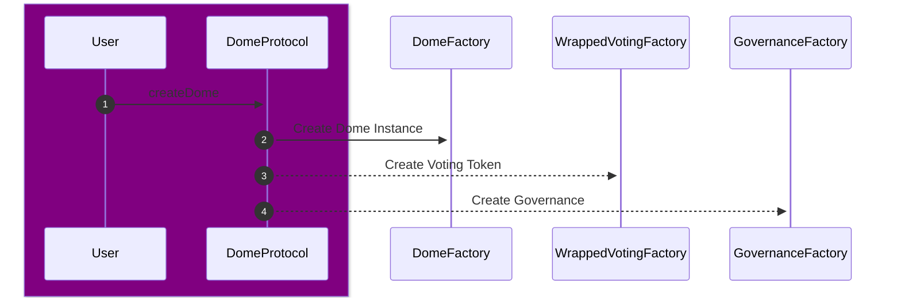
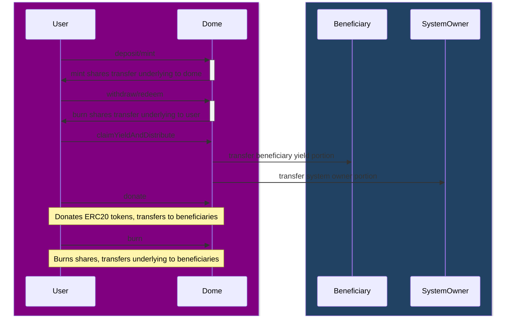
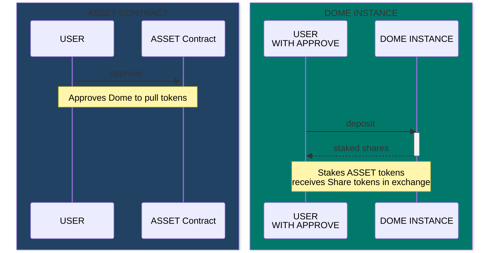
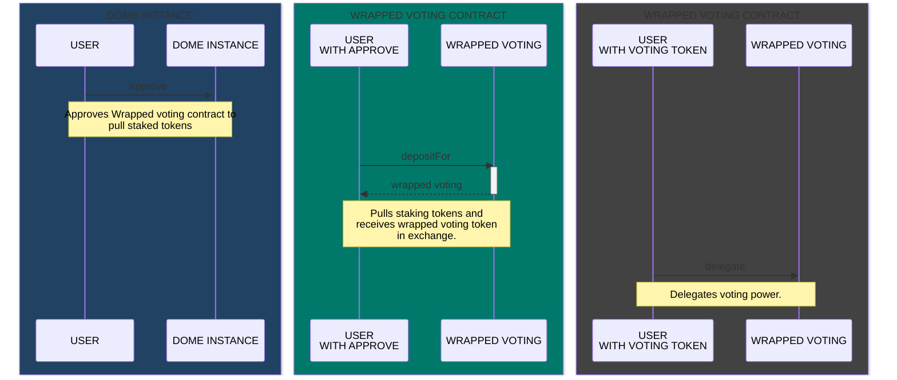
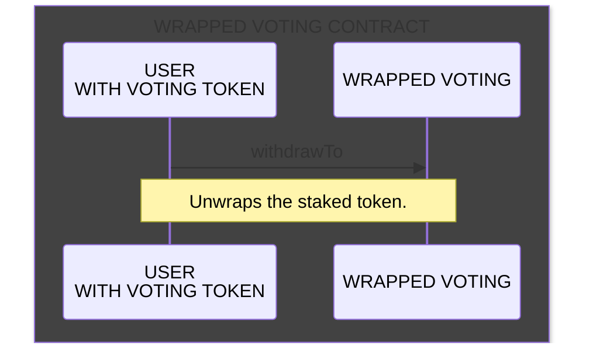
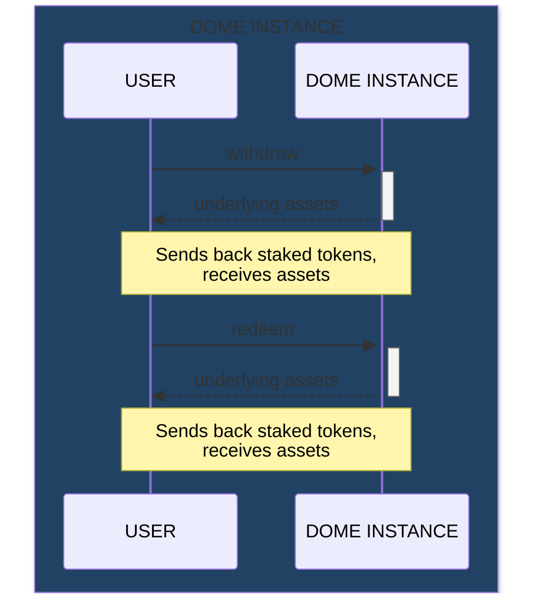

# Dome Safe - Original Dome Protocol

> 🟢 **Low Risk** - Stable yield generation with battle-tested ERC-4626 vaults (Aave)

The Dome Protocol enables the creation of dome structures with predefined governance settings, beneficiaries, and yield generation mechanisms.

---

## Core Contracts

### DomeProtocol

[`DomeProtocol.sol`](./DomeProtocol.sol) enables the creation of dome structures by providing dome information, beneficiary details, governance settings, and yield generation parameters.

**Features:**

- **Dome Creation** - Create dome structures with predefined rules and functionalities
- **Governance Integration** - Parameters include voting delay, voting period, and proposal threshold
- **Yield Generation** - Specify percentage of yield allocated to depositors as rewards
- **Fee Management** - System owner percentages and dome creation fees

**Interfaces:**

- `Ownable` - Ownership functionalities for access control
- `IGovernanceFactory` - Creating governance contracts for dome structures
- `IWrappedVotingFactory` - Creating wrapped voting contracts
- `IDomeFactory` - Initializing dome structures

### DomeCore

[`DomeCore.sol`](./DomeCore.sol) is the main vault where users can deposit assets, mint shares, and manage beneficiary distributions.

**Features:**

- **Deposit and Mint** - Deposit assets and receive shares
- **Withdraw and Redeem** - Retrieve deposited assets
- **Yield Generation** - Generate yield from deposited assets
- **Beneficiary Distribution** - Distribute yield to predefined beneficiaries

**Interfaces:**

- `IERC20` - ERC20 standard for fungible tokens
- `IERC4626` - ERC4626 vault functionality
- `IBuffer` - Asset management and distribution
- `IDomeProtocol` - Protocol interface

### Governance

[`Governance.sol`](./Governance.sol) is a decentralized governance protocol allowing token holders to propose and vote on changes.

**Features:**

- **Proposal Creation** - Suggest changes including recipient wallet, asset amount, title, and description
- **Voting** - Vote using token-weighted voting power
- **Execution and Cancellation** - Execute or cancel proposals
- **Reserve Fund Management** - Transfer reserve funds from the protocol

---

## Architecture

### Protocol Creation Flow



### Dome Operations Flow



---

## User Guide

### Staking

1. **Approve the Dome** to pull your assets:
   - Call `asset()` on the Dome to get the underlying token address
   - Call `approve(domeAddress, amount)` on the asset contract

2. **Deposit assets**:
   - Call `deposit(amount, receiver)` on the Dome
   - Receive share tokens in exchange



### Voting

To participate in governance:

1. **Approve Wrapped Voting contract** to pull your staked tokens
2. **Wrap tokens**: Call `depositFor(amount)` to exchange staked tokens for voting tokens
3. **Delegate**: Call `delegate(address)` to assign voting power (usually to yourself)



### Unstaking

1. **Check voting balance**: Call `balanceOf(address)` on Wrapped Voting contract
2. **Unwrap** (if balance > 0): Call `withdrawTo(address)` to burn voting tokens and receive staked tokens
3. **Withdraw**: Call `withdraw(amount, receiver, owner)` or `redeem(shares, receiver, owner)`





---

## Yield Provider Configuration

The protocol owner maintains an allow-list of yield providers through `configureYieldProviders`. Each dome records the provider type it was created with.

### Supported Providers

| Provider | Type | Description |
|----------|------|-------------|
| **Aave** | `YIELD_PROVIDER_TYPE_AAVE` | Original ERC-4626 flow, battle-tested |
| **Hyperliquid** | `YIELD_PROVIDER_TYPE_HYPERLIQUID` | High-risk, volatile positions |

### Activating a Provider

```javascript
await domeProtocol.configureYieldProviders([
  {
    provider: vaultAddress,
    providerType: await domeProtocol.YIELD_PROVIDER_TYPE_HYPERLIQUID(),
    enabled: true,
  },
]);
```

Disable a provider by setting `enabled` to `false`.

> ⚠️ **Warning**: Hyperliquid positions are volatile; you can lose principal when funding rates or liquidation events move against the position.

---

## Deployment

### Prerequisites

1. Ethereum accounts configured for deployment
2. Environment variables set (see below)
3. Network configuration in `hardhat.config.js`

### Environment Variables

```env
# Required
DEPLOY_PRIV_KEY=<private-key>
DOME_CREATION_FEE=<fee-in-wei>
SYSTEM_OWNER_PERCENTAGE=<up-to-2500>
SYSTEM_OWNER=<wallet-address>

# Network RPCs
POLYGON_RPC_URL=<rpc-url>
MAINNET_RPC_URL=<rpc-url>
ARBITRUM_RPC_URL=<rpc-url>
GOERLI_RPC_URL=<rpc-url>
AMOY_RPC_URL=<rpc-url>
ARBITRUM_SEPOLIA_RPC_URL=<rpc-url>

# After protocol deployment
DOME_PROTOCOL_ADDRESS=<protocol-address>

# Verification
POLYGON_API_KEY=<api-key>
MAINNET_API_KEY=<api-key>
ARBITRUM_API_KEY=<api-key>
```

### Deploy DomeProtocol

```bash
npm run deployProtocol -- --network <network>

# Or use predefined scripts
npm run deployProtocol:polygon
npm run deployProtocol:mainnet
npm run deployProtocol:arbitrum
```

This deploys:
- `DomeProtocol`
- `DomeFactory`
- `GovernanceFactory`
- `WrappedVotingFactory`
- `Buffer`

### Deploy a Dome Instance

1. Set `DOME_PROTOCOL_ADDRESS` in your `.env`
2. Configure parameters in `scripts/deployDome.js`:
   - `DomeInfo` (CID, TokenName, TokenSymbol)
   - `BeneficiariesInfo` (CID, wallet address, percent)
   - `YieldProtocol` (ERC-4626 vault address)
   - `DepositorYieldPercent` (up to 10000 = 100%)
   - `GovernanceSettings` (if buffer is a beneficiary)

3. Deploy:

```bash
npm run deployDome -- --network <network>

# Or use predefined scripts
npm run deployDome:polygon
npm run deployDome:mainnet
npm run deployDome:arbitrum
```

### Finding Compatible Yield Protocols

Browse [ERC-4626 vaults](https://erc4626.info/vaults/) for compatible protocols. To find the underlying asset:

1. Go to the vault contract on a block explorer
2. Navigate to "Read Contract" (or "Read as Proxy" for upgradable contracts)
3. Call the `asset()` function

---

## Verification

### Verify DomeProtocol

```bash
npm run verifyProtocol:<network>

# Or verify latest deployment
npm run verifyLatestProtocol:<network>
```

### Verify Dome Instance

Configure `scripts/verifyDome.js` with:
- `domeInfo`, `beneficiariesInfo`, `yieldProtocol`
- `systemOwner`, `domeProtocolAddress`
- `systemOwnerPercentage`, `depositorYieldPercent`

```bash
npm run verifyDome:<network>

# Or verify latest deployment
npm run verifyLatestDome:<network>
```

---

## Testing

```bash
# Run all tests (Polygon mainnet fork)
npm run test

# Requires POLYGON_RPC_URL to be set
```

### Test Coverage

- DomeProtocol contract functionality
- DomeInstance contract functionality
- Governance mechanisms
- Burn operations
- Donation operations

Total: 102 individual tests

---

## Gas Reporting

Enable detailed gas reporting:

```env
COINMARKETCAP_API=<your-api-key>
```

Get an API key from [CoinMarketCap](https://coinmarketcap.com/api/).

---

## Testing Environment

Deploy a complete testing environment:

```bash
npm run deployTestingEnv:amoy
```
